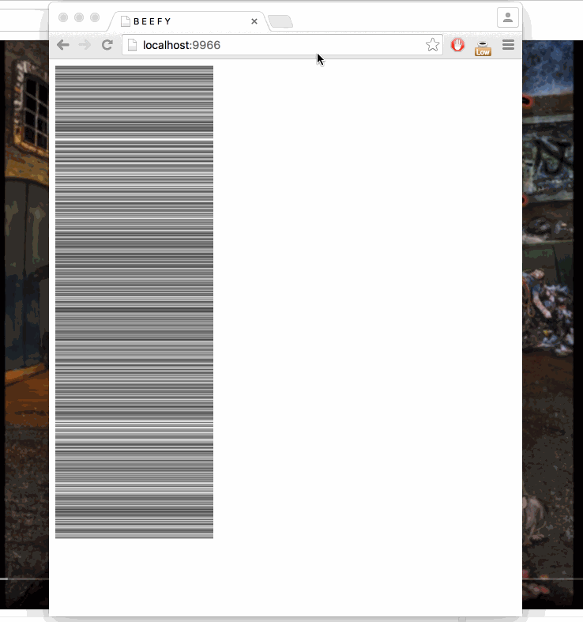

# fill-colorcoded-bar

  Progressively fill a [colorcoded-bar](https://npmjs.org/package/colorcoded-bar) based on an async data source.

## Screencast

  This shows two bars rendering the same data, using different strategies.

  

## Example

  [](http://requirebin.com/?gist=5d2096105d5acd69325d)

```js
var fill = require('fill-colorcoded-bar');
var Bar = require('colorcoded-bar');
var raf = require('raf');

var canvas = document.createElement('canvas');
document.body.appendChild(canvas);
var bar = new Bar;

var status = fill(bar, {
  strategy: 'topdown',
  length: 1000
}, function(i, cb){
  setTimeout(function(){
    cb(null, 'rgba(1, 1, 1, ' + Math.random() + ')');
  }, Math.random() * 300);
});

(function draw(){
  bar.render({ width: 100, height: 600, canvas: canvas });
  if (status.fetching) raf(draw);
})();
```

## Installation

```bash
$ npm install fill-colorcoded-bar
```

## API

### fill(bar[, opts], fetch)

  Fill [colorcoded-bar](https://npmjs.org/package/colorcoded-bar) `bar` based on function `fetch` which is expected to take `(i, callback)` and call `callback` with `(null, color)`.

  Options:

- `strategy` choose the strategy:
  - `"topdown"`: render top to bottom
  - `"refine"`: progressively refine the bar
- `length`: total data length, required by the refine strategy
- `concurrency`: concurrency when calling `fetch`. defaults to `10`

Returns an EventEmitter that will emit `"done"` when done and has a `.fetching` that becomes `false` once everything is done.

## License

  MIT

